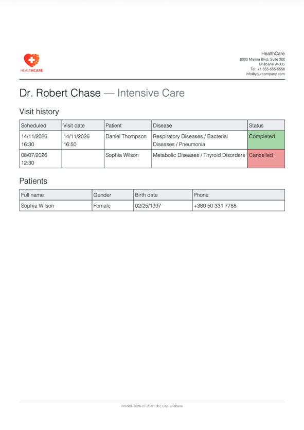

# Odoo Learning Modules

## Library

Implements a basic library system with books, authors, and demo data.

### Features
- Book management (`library.book`)
- Author relation using `res.partner`
- Menu structure
- Form and list views
- Demo data

### Structure
- `models/` – Python models
- `views/` – XML views and menus
- `security/` – access rights
- `static/` – resources
- `demo/` – demo data
- `__manifest__.py` – module definition

## HR Hospital (Homework)

Implements a hospital management system for managing doctors, patients, diseases, visits, and doctor assignment history.

### Features
- Doctor management (`hospital.doctor`)
- Patient management (`hospital.patient`)
- Disease dictionary (`hospital.disease`)
- Visit management (`hospital.visit`)
- Doctor assignment history (`hospital.doctor.history`)
- Doctor categories and mentor support for interns
- Automatic synchronization between Patient and Doctor History
- Mass doctor reassignment wizard
- Visit report wizard with filtering by doctor, patient, disease, status, and date range
- Menu structure (Hospital → Doctors / Patients / Diseases / Visits)
- Form and list views for all models
- Access rights for internal users (`base.group_user`)
- Master and demo data

### Structure
- `models/` – Python models (Doctor, Patient, Disease, Visit, Doctor History, Doctor Category)
- `wizard/` – Transient models for mass doctor reassignment and visit reports
- `views/` – XML views, actions, menus, and wizard views
- `security/` – access rights (`ir.model.access.csv`)
- `data/` – master data (doctor categories, diseases)
- `demo/` – demo data (doctors, patients, visits)
- `static/` – resources
- `report/` – report templates
- `__manifest__.py` – module definition

### Report Example

